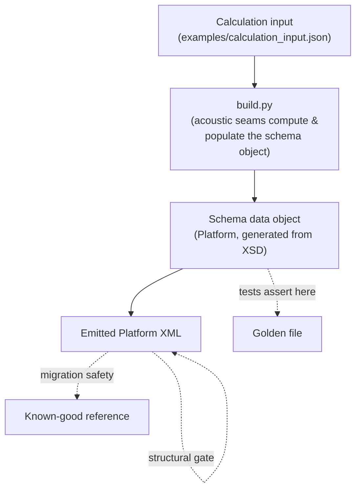
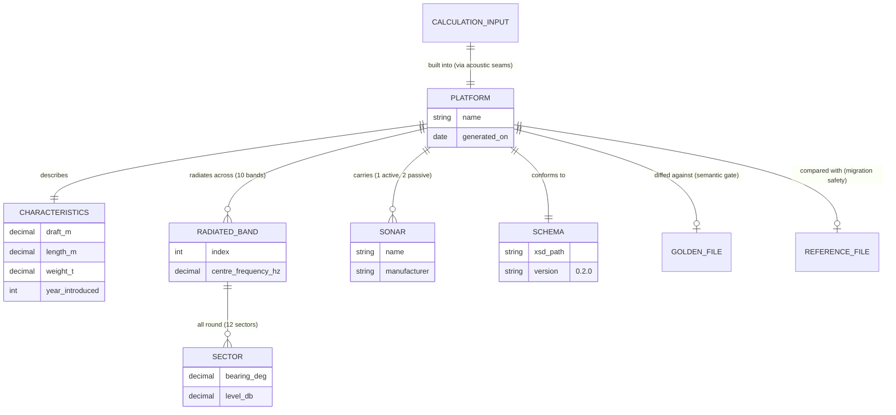

# Pipeline data flow

> **Explanation** — the entities that move through Phase 1 and how they relate.

## The flow, end to end

The acoustic seams compute the values and the builder populates **one schema data object**
directly — there is no intermediate domain hierarchy built only to be converted (ADR 0010).
That object, before serialisation, is the **typed testable boundary**: tests assert on it
directly, or diff the serialised XML against a golden file. No separate intermediate (no CSV,
no pickle) is needed to get testability; that whole chain was removed (ADR 0002).

## The entities as an ER diagram

This **Mermaid ERD** is drawn by hand for the data-flow story (it deliberately includes pipeline
entities like the golden and reference files). The
**[schema reference](../reference/schema/index.html)**, by contrast, is produced
**automatically from the schema** (as HTML) by `make gen-schema-docs`
(ADR 0011).

## Reading the entities

| Entity | What it is | Key rule |
|---|---|---|
| **Acoustic seams** | The named, testable calculation functions (`band_centre_hz`, …) | Pure `float` arithmetic; feed the builder |
| **Schema data object** | The generated `Platform` the builder populates directly | The assertion boundary; built to meet the schema |
| **Platform XML** | The validated, round-tripped Phase 1 deliverable | Must pass both gates before it's trusted |
| **Golden file** | Trusted expected output | Drives the semantic gate; changed deliberately |
| **Reference file** | Prior-process output | Drives migration-safety comparison |
| **Schema** | The enriched XSD | The contract; everything derives from it |

For the authoritative entity definitions and field rules, see the planning artifact
`specs/001-codespace-xml-scaffold/data-model.md`.
