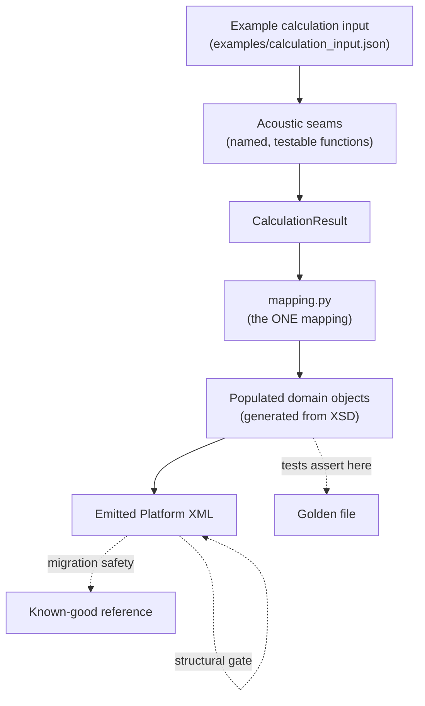
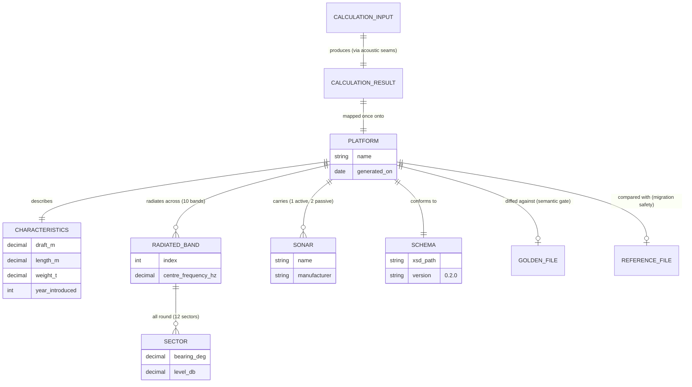

# Pipeline data flow

> **Explanation** — the entities that move through Phase 1 and how they relate.

## The flow, end to end

The **populated domain objects, before serialisation, are the typed testable boundary** —
tests assert on them directly, or diff the serialised XML against a golden file. No separate
intermediate (no CSV, no pickle) is needed to get testability; that whole chain was removed
(ADR 0002).

## The entities as an ER diagram

This is the kind of **Mermaid ERD** the docs render — here drawn by hand for the data-flow story
(it deliberately includes pipeline entities like the golden and reference files). The
**[schema reference](../reference/schema/index.md)** ERD, by contrast, is produced
**automatically from the schema** by `make gen-schema-docs`
(ADR 0009).

## Reading the entities

| Entity | What it is | Key rule |
|---|---|---|
| **CalculationResult** | Output of the acoustic seams (the recalculation/resampling step) | Produced by discrete, testable functions |
| **Populated domain objects** | Generated-model instances after the single mapping | The assertion boundary; the one place logic lives |
| **Platform XML** | The validated, round-tripped Phase 1 deliverable | Must pass both gates before it's trusted |
| **Golden file** | Trusted expected output | Drives the semantic gate; changed deliberately |
| **Reference file** | Prior-process output | Drives migration-safety comparison |
| **Schema** | The enriched XSD | The contract; everything derives from it |

For the authoritative entity definitions and field rules, see the planning artifact
`specs/001-codespace-xml-scaffold/data-model.md`.
