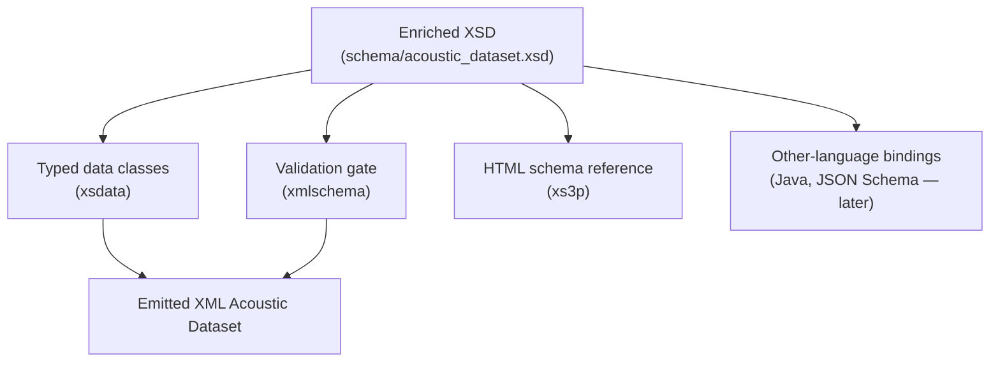

# Schema as the contract

> **Explanation** — the central idea everything else follows from.

## The idea

In this project the **XSD schema is the contract** between organisations and between tools.
It is the single source of truth for *what a valid Acoustic Dataset document is*. Everything
else — the typed data classes, the validation, the HTML reference, the ER diagram, any
language bindings — is **derived from it**, never maintained in parallel with it.

This is the plain statement of two of the delivery plan's carried principles:

- **Configure, don't create** — if the schema can generate something, we generate it.
- **Data as the contract** — the schema *and* the data are the inter-organisational contract;
  documents and bindings are downstream projections.

## Why it matters

The failure mode we are designing against is **drift**: several hand-maintained
representations of "the format" slowly disagreeing. The old `write_xml.py` was one such
representation living in code; a hand-edited model class would be another; a hand-drawn
diagram a third. Each is a place the truth can rot.

If there is exactly **one** source (the XSD) and everything else is generated from it, drift
becomes structurally impossible — you change the schema and re-generate, or you don't change
the format at all. CI enforces this by regenerating and failing on any difference
(see [ADR 0008](../decisions/0008-generated-models-no-drift.md)).

## What flows from the one source

## "Enriched" — where definitions live

An **enriched** XSD carries human documentation *inside* the schema using
`xs:annotation/xs:documentation` (not XML comments, which are discarded at parse time). That
choice has leverage: the same annotation becomes

- the **docstring** on the generated data class, and
- the prose in the **generated HTML reference** and the labels in the **ERD**.

So a definition is written **once, in the contract**, and shows up everywhere a consumer might
look. By contrast, *engineering "how it's computed"* notes do **not** belong in the schema —
the schema knows nothing about the calculation — they live on the methods in code.

## The boundary of the guarantee

Working in schema-derived entities is a real gain, but be precise about its limits:
**entity-level modelling is solid; field-level type strength is only as rich as the XSD
declares.** If the schema types a field as a plain string, the generated class has a string —
the contract can't give you stronger typing than it states. This is why getting the *schema*
right (and enriched) is the high-leverage work.

## See also

- [The two verification gates](two-verification-gates.md) — why schema-valid isn't enough.
- [Pipeline data flow](pipeline-data-flow.md) — the entities and how they move.
- ADRs [0001](../decisions/0001-schema-driven-generation-with-xsdata.md),
  [0008](../decisions/0008-generated-models-no-drift.md),
  [0009](../decisions/0009-mkdocs-material-mermaid-html-docs.md).
