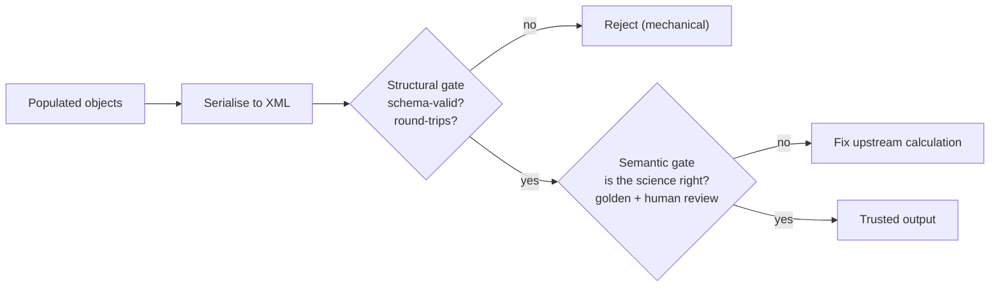

# The two verification gates

> **Explanation** — why "the schema says it's valid" is not the same as "it's correct."

## Two different questions

When the pipeline emits a document, there are **two genuinely separate questions** to ask:

1. **Is it structurally sound?** Well-formed, conformant to the XSD, and unchanged by a
   round trip. This is *mechanical* — a computer can decide it.
2. **Is it scientifically right?** Was the recalculation/resampling onto the schema's bands
   actually correct? This is a matter of *acoustic judgement* — no schema can decide it.

Treating the first as if it answered the second is the classic trap. The delivery plan states
it directly: **"schema-valid is not the same as correct."** So we keep two gates.

## Gate 1 — Structural (mechanical, automated)

Three mechanical checks, all in CI:

- **Conformant by construction** — output comes from schema-generated objects
  ([ADR 0001](../decisions/0001-schema-driven-generation-with-xsdata.md)), so it starts in
  the right shape.
- **XSD validation** — `xmlschema` confirms the document validates against the contract
  ([ADR 0003](../decisions/0003-xmlschema-as-validation-gate.md)).
- **Round-trip** — parse the XML back and re-serialise; if it changed meaningfully, a binding
  or serialisation loss occurred. This catches things validation alone cannot.

Passing Gate 1 means the document is *well-formed and conformant* — nothing more.

## Gate 2 — Semantic (human judgement)

The question Gate 1 can't answer: **is the underlying science right?** This stays a human
gate, supported by **golden files** (a trusted expected output that tests diff against) and
expert sign-off. Crucially, *correctness lives upstream in the calculation* — if the science
is wrong, you fix the acoustic function, not the XML. That is why the calculation is
decomposed into named, documented, individually testable units: a domain expert can sign off
one well-named function, not a 500-line script.

## A third, related check: migration safety

Distinct from both gates is the **schema-valid-but-different** check. When replacing an old
generator, new output can be perfectly schema-valid yet differ from files a consumer already
depends on (perhaps relying on a quirk of the old hand-rolled output). The migration-safety
comparison diffs new output against a known-good **reference** file to surface exactly this.
See [Change the schema](../how-to/change-the-schema.md) and
[ADR 0004](../decisions/0004-two-gate-verification.md).

## Why split them at all?

Because each gate, kept separate, does one job and can't mask the other. Automate the half a
computer can judge; keep a human firmly in the loop for the half it can't. Over time, a
semantic rule that becomes stable (e.g. "values must be monotonic across bands") can be
*promoted* from the human gate into an automated structural check — but that is a deliberate
move, not an assumption.
