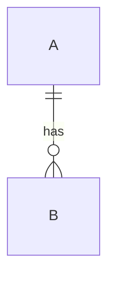

# How to build the docs site

> **How-to** — produce and preview the attractive HTML documentation.

The docs are written in Markdown under `docs/` and rendered by **MkDocs Material**
(ADR 0009). Mermaid diagrams render
natively.

## Preview while you write

```bash
make docs-serve
```

Opens a live-reloading preview at <http://localhost:8000>. Edit any `.md` file and the page
refreshes.

## Build the static site

```bash
make docs        # = mkdocs build --strict, output in site/
```

`--strict` turns warnings into errors, so a broken internal link or a page missing from the
nav **fails the build** (and fails CI). The `site/` output is a generated artifact and is
gitignored.

## Add a page

1. Create the Markdown file in the right folder (`tutorials/`, `how-to/`, `concepts/`,
   `decisions/`, `reference/`).
2. Add it to the `nav:` in `mkdocs.yml` — **every** page must be in the nav or `--strict`
   fails.
3. Run `make docs` to confirm it builds.

## Add a Mermaid diagram

Use a fenced ```mermaid block:

````markdown

````

See the [pipeline ERD](../concepts/pipeline-data-flow.md) and the
[generated schema ERD](../reference/schema/index.md) for working examples.

## Schema reference & ERD are *generated*

The [schema reference](../reference/schema/index.md) — the entity tables and the Mermaid ERD —
is produced from the **enriched XSD** by `make gen-schema-docs`, not hand-written, so it can't
drift from the contract. Regenerate it after any schema change; the CI drift gate fails if the
committed page is stale.

## Linking rules (to keep `--strict` happy)

- Link between docs pages with **relative paths** to the `.md` file
  (e.g. `../decisions/0001-schema-driven-generation-with-xsdata.md`).
- Refer to files **outside** `docs/` (like `specs/...` or `src/...`) as inline code, **not**
  as Markdown links — MkDocs can't resolve paths outside `docs_dir` and would fail the build.
