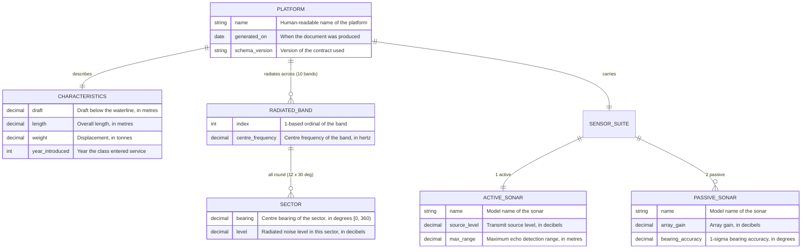

# Schema ERD (example)

> **Reference** — an example of the **generated** Mermaid ER diagram.

!!! info "This is a hand-drawn stand-in"
    Once the real enriched XSD is in place, `make gen-schema-docs` produces this page
    **automatically from the schema** — entities, fields, relationships, and the
    `xs:documentation` prose all read from the XSD so the diagram can't drift from the contract
    ([ADR 0009](../decisions/0009-mkdocs-material-mermaid-html-docs.md)). The diagram below
    shows the intended shape for the *placeholder* schema.

## Entities and relationships

## How to read it

- `||--o{` means "one to zero-or-many" — one `PLATFORM` radiates across many
  `RADIATED_BAND`s, each holding many `SECTOR`s.
- `||--||` means "one to one".
- The text after each field (e.g. *"Lower edge of the band"*) is exactly what the **enriched
  XSD** will carry in `xs:annotation/xs:documentation` — the same prose that becomes the
  generated data-class docstrings. One source, many outputs
  ([Schema as the contract](../concepts/schema-as-contract.md)).

## Why generate it (rather than draw it)

A hand-drawn diagram is a second source of truth that rots. Generating the ERD from the schema
means the picture and the contract are *the same artefact viewed two ways* — change the schema,
regenerate, and the diagram is correct by construction
([ADR 0008](../decisions/0008-generated-models-no-drift.md)).
