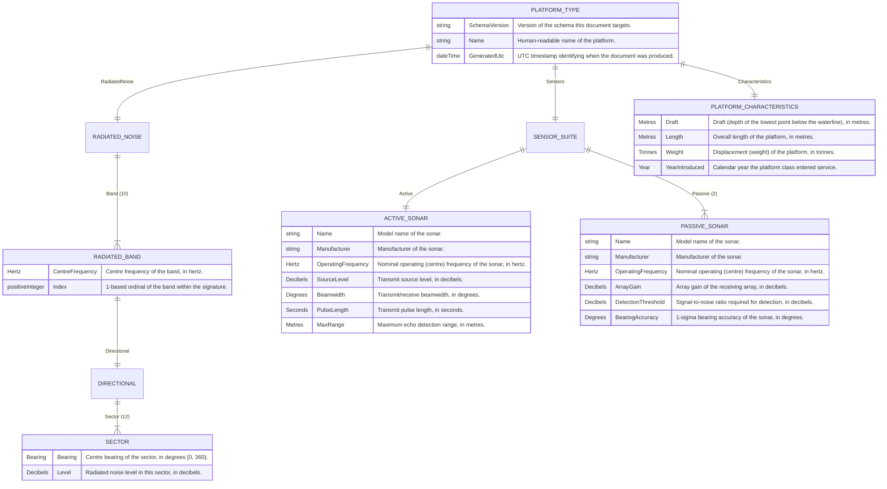

<!-- DO NOT EDIT BY HAND. Generated from schema/acoustic_dataset.xsd by `make gen-schema-docs`. -->
<!-- Regenerate after any schema change; CI fails on drift. See docs/decisions/0008 and 0009. -->
# Schema reference

> **Reference (generated)** — produced from `schema/acoustic_dataset.xsd` (version `0.2.0-placeholder`) by `make gen-schema-docs`. Every entity, field, range and definition below is read from the XSD's `xs:annotation/xs:documentation`, so this page cannot drift from the contract.

Placeholder Platform schema. A document describes one platform: its physical characteristics, its directional radiated-noise signature across ten frequency bands, and the sonar sensors it carries. The banded numeric types below carry real XSD facets (ranges) and the radiated-noise structure carries enforced cardinalities (exactly ten bands, exactly twelve 30-degree sectors per band) so the validation gate has something meaningful to enforce.

## Entity-relationship diagram

Legend: `||--||` one-to-one, `||--|{` one-to-(one-or-many), `||--o{` one-to-(zero-or-many). The number in each label is the exact cardinality the schema enforces. Sonar sub-types show their inherited fields inline.

## Entities

### PlatformCharacteristics

The physical characteristics of the platform.

| Field | Type | Cardinality | Definition |
|---|---|---|---|
| `Draft` | [`Metres`](#banded-numeric-types) | 1 | Draft (depth of the lowest point below the waterline), in metres. |
| `Length` | [`Metres`](#banded-numeric-types) | 1 | Overall length of the platform, in metres. |
| `Weight` | [`Tonnes`](#banded-numeric-types) | 1 | Displacement (weight) of the platform, in tonnes. |
| `YearIntroduced` | [`Year`](#banded-numeric-types) | 1 | Calendar year the platform class entered service. |

### Sector

The radiated noise level in one 30-degree bearing sector of a band.

| Field | Type | Cardinality | Definition |
|---|---|---|---|
| `Bearing` | [`Bearing`](#banded-numeric-types) | 1 | Centre bearing of the sector, in degrees [0, 360). |
| `Level` | [`Decibels`](#banded-numeric-types) | 1 | Radiated noise level in this sector, in decibels. |

### Directional

The all-round radiated noise for one band: exactly twelve sectors at 30-degree intervals, in ascending bearing order (0, 30, ..., 330).

| Field | Type | Cardinality | Definition |
|---|---|---|---|
| `Sector` | [`Sector`](#sector) | 12 | One 30-degree bearing sector. |

### RadiatedBand

The directional radiated noise for one frequency band.

| Field | Type | Cardinality | Definition |
|---|---|---|---|
| `CentreFrequency` | [`Hertz`](#banded-numeric-types) | 1 | Centre frequency of the band, in hertz. |
| `Directional` | [`Directional`](#directional) | 1 | The twelve 30-degree directional noise sectors for this band. |
| `index` | `xs:positiveInteger` | 1 (attribute) | 1-based ordinal of the band within the signature. |

### RadiatedNoise

The platform's radiated-noise signature: exactly ten frequency bands, in ascending index order.

| Field | Type | Cardinality | Definition |
|---|---|---|---|
| `Band` | [`RadiatedBand`](#radiatedband) | 10 | One frequency band of the radiated-noise signature. |

### Sonar

Fields common to every sonar: identity plus a nominal operating frequency.

| Field | Type | Cardinality | Definition |
|---|---|---|---|
| `Name` | `xs:string` | 1 | Model name of the sonar. |
| `Manufacturer` | `xs:string` | 1 | Manufacturer of the sonar. |
| `OperatingFrequency` | [`Hertz`](#banded-numeric-types) | 1 | Nominal operating (centre) frequency of the sonar, in hertz. |

### ActiveSonar

An active sonar: it transmits, so it carries a source level and beam/pulse figures, and a derived maximum (echo) detection range.

Extends [`Sonar`](#sonar); inherited fields are marked below.

| Field | Type | Cardinality | Definition |
|---|---|---|---|
| `Name` *(from Sonar)* | `xs:string` | 1 | Model name of the sonar. |
| `Manufacturer` *(from Sonar)* | `xs:string` | 1 | Manufacturer of the sonar. |
| `OperatingFrequency` *(from Sonar)* | [`Hertz`](#banded-numeric-types) | 1 | Nominal operating (centre) frequency of the sonar, in hertz. |
| `SourceLevel` | [`Decibels`](#banded-numeric-types) | 1 | Transmit source level, in decibels. |
| `Beamwidth` | [`Degrees`](#banded-numeric-types) | 1 | Transmit/receive beamwidth, in degrees. |
| `PulseLength` | [`Seconds`](#banded-numeric-types) | 1 | Transmit pulse length, in seconds. |
| `MaxRange` | [`Metres`](#banded-numeric-types) | 1 | Maximum echo detection range, in metres. |

### PassiveSonar

A passive sonar: it only listens, so it carries array gain, a detection threshold and a bearing accuracy rather than a transmit source level.

Extends [`Sonar`](#sonar); inherited fields are marked below.

| Field | Type | Cardinality | Definition |
|---|---|---|---|
| `Name` *(from Sonar)* | `xs:string` | 1 | Model name of the sonar. |
| `Manufacturer` *(from Sonar)* | `xs:string` | 1 | Manufacturer of the sonar. |
| `OperatingFrequency` *(from Sonar)* | [`Hertz`](#banded-numeric-types) | 1 | Nominal operating (centre) frequency of the sonar, in hertz. |
| `ArrayGain` | [`Decibels`](#banded-numeric-types) | 1 | Array gain of the receiving array, in decibels. |
| `DetectionThreshold` | [`Decibels`](#banded-numeric-types) | 1 | Signal-to-noise ratio required for detection, in decibels. |
| `BearingAccuracy` | [`Degrees`](#banded-numeric-types) | 1 | 1-sigma bearing accuracy of the sonar, in degrees. |

### SensorSuite

The sonar fit carried by the platform: one active sonar and two passive sonars.

| Field | Type | Cardinality | Definition |
|---|---|---|---|
| `Active` | [`ActiveSonar`](#activesonar) | 1 | The platform's single active sonar. |
| `Passive` | [`PassiveSonar`](#passivesonar) | 2 | The platform's two passive sonars. |

### PlatformType (root element `Platform`)

A single platform: titled, timestamped reference data in three parts — physical characteristics, directional radiated noise, and the sonar fit.

| Field | Type | Cardinality | Definition |
|---|---|---|---|
| `SchemaVersion` | `xs:string` | 1 | Version of the schema this document targets. |
| `Name` | `xs:string` | 1 | Human-readable name of the platform. |
| `GeneratedUtc` | `xs:dateTime` | 1 | UTC timestamp identifying when the document was produced. |
| `Characteristics` | [`PlatformCharacteristics`](#platformcharacteristics) | 1 | The platform's physical characteristics. |
| `RadiatedNoise` | [`RadiatedNoise`](#radiatednoise) | 1 | The platform's directional radiated-noise signature. |
| `Sensors` | [`SensorSuite`](#sensorsuite) | 1 | The platform's sonar fit. |

## Banded numeric types

The numeric primitives below carry real XSD range facets, so an out-of-band value fails the validation gate.

| Type | Base | Range | Definition |
|---|---|---|---|
| `Decibels` | `xs:decimal` | ≥ -200, ≤ 300 | A level expressed in decibels (dB), bounded to a sane sonar range. |
| `Metres` | `xs:decimal` | ≥ 0 | A non-negative distance in metres. |
| `Hertz` | `xs:decimal` | ≥ 0 | A non-negative frequency in hertz (Hz). |
| `Tonnes` | `xs:decimal` | ≥ 0 | A non-negative mass/displacement in tonnes (1000 kg). |
| `Seconds` | `xs:decimal` | ≥ 0 | A non-negative duration in seconds. |
| `Degrees` | `xs:decimal` | ≥ 0, ≤ 360 | An angle in degrees, in the closed interval [0, 360] (e.g. a beamwidth). |
| `Bearing` | `xs:decimal` | ≥ 0, < 360 | A compass bearing in degrees, in the half-open interval [0, 360): 0 is dead ahead, increasing clockwise. Radiated-noise sectors are spaced 30 degrees apart. |
| `Year` | `xs:integer` | ≥ 1900, ≤ 2100 | A Gregorian calendar year, constrained to a sane modern range [1900, 2100]. |

